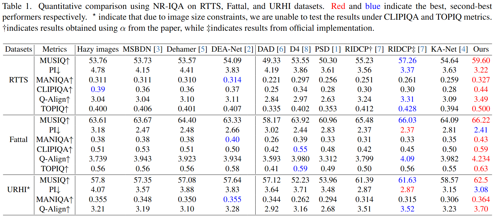

# Iterative Predictor-Critic Code Decoding for Real-World Image Dehazing (CVPR2025)

<a href='https://arxiv.org/pdf/2503.13147'></a> &nbsp;&nbsp;
<a href='https://jiayi-fu.github.io/IPC-Dehaze_Homepage/static/pdfs/IPC_Dehaze-CN.pdf'></a> &nbsp;&nbsp;
<a href='https://jiayi-fu.github.io/IPC-Dehaze_Homepage/'></a> &nbsp;&nbsp;
<a href='https://pan.baidu.com/s/1W4Mt_uZprSjxj1oH8MU59w'></a> &nbsp;&nbsp;


This is the official PyTorch codes for the paper:

>**Iterative Predictor-Critic Code Decoding for Real-World Image Dehazing**<br>  [Jiayi Fu<sup>1</sup>](https://github.com/Jiayi-Fu), [Siyu Liu<sup>1</sup>](https://github.com/modyu-liu), Zikun Liu<sup>3</sup>, [Chun-Le Guo<sup>1,2</sup>](https://mmcheng.net/clguo/), Hyunhee Park<sup>4</sup>, [Ruiqi Wu<sup>1</sup>](https://rq-wu.github.io/), Guoqing Wang<sup>5</sup>, [Chongyi Li<sup>*,1,2</sup>](https://li-chongyi.github.io/)  
> <sup>1</sup>VPIC, CS, Nankai University, <sup>2</sup>NKIARI, Shenzhen Futian<sup>3</sup>, Samsung R&D Institute China-Beijing, <sup>4</sup> CIG, Samsung Electronics,<sup>5</sup> Donghai Laboratory, Zhoushan, Zhejiang. <sup>*</sup> Indicates Corresponding Author  


:star: If IPC-Dehaze is helpful to your images or projects, please help star this repo. Thank you! :point_left:


## :runner: TODO
- [x] Release training code
- [x] 发布论文的中文版 (Release the Chinese version of the paper)
- [x] Release results and testing code. More visual results can be fonud in the the <a href='https://jiayi-fu.github.io/IPC-Dehaze_Homepage/'>project page</a>. 


## :wrench: Dependencies and Installation

1. Clone repo

```bash
git https://github.com/Jiayi-Fu/IPC-Dehaze.git
cd IPC-Dehaze 
```

2. Install packages
```bash
conda create -n ipc python=3.8
conda activate ipc
pip install -r requirements.txt
```

## 🚀 Quick Inference
### Step1: Downloading pretrained checkpoints
Download `predictor.pth` and `critic.pth` and place them in the following directories: `pretrained_models`
<table>
<thead>
<tr>
    <th>Model</th>
    <th> Description </th>
    <th>:link: Download Links </th>
</tr>
</thead>
<tbody>
<tr>
    <td>VQGAN</td>
    <th>VQGAN generetor pretrained on high-quality data.</th>
    <th rowspan="4">
    [<a href="https://drive.google.com/drive/folders/1i5DS0jjTlm1nSXSAPd4Qp5_7dLSva_1E?usp=sharing">Google Drive</a>] 
    [<a href="https://pan.baidu.com/s/1W4Mt_uZprSjxj1oH8MU59w">Baidu Disk (pwd: jfsp)</a>]
    </th>
</tr>
<tr>
    <td>VQGAN-D</td>
    <th>VQGAN discriminator.</th>
</tr>
<tr>
    <td>Predictor</td>
    <th>Predict high-quality code in dehazing.</th>
</tr>
<tr>
    <td>Critic</td>
    <th>Evaluate the predicted code.</th>
</tr>
</tbody>
</table>

### Step2: Running testing command
```bash
python inference.py -i examples -o results 
```
The results can be found in [<a href="https://pan.baidu.com/s/1W4Mt_uZprSjxj1oH8MU59w">Baidu Disk (pwd: jfsp)</a>]

### Option: Downloading test datasets
<table>
<thead>
<tr>
    <th> Dataset </th>
    <th>:link: Download Links </th>
</tr>
</thead>
<tbody>
<tr>
    <td>URHI</td>
    <th>
    <a href="https://utexas.app.box.com/s/2yekra41udg9rgyzi3ysi513cps621qz">Download</a></th>
</tr>
<tr>
    <td>RTTS</td>
    <th>
    <a href="https://utexas.app.box.com/s/7hu094vwkw0cwowv5wijwv9pure2fvup?page=2">Download</a></th>
</tr>
</tbody>
</table>

## :muscle: Train
### Step1: Prepare training dataset
Preparing data for training(same to <a href="https://github.com/RQ-Wu/RIDCP_dehazing">RIDCP</a>)
<table>
<thead>
<tr>
    <th>Dataset</th>
    <th> Description </th>
    <th>:link: Download Links </th>
</tr>
</thead>
<tbody>
<tr>
    <td>rgb_500</td>
    <th>500 clear RGB images as the input of our phenomenological degradation pipeline</th>
    <th rowspan="2">
    [<a href="https://pan.baidu.com/s/1oX3AZkVlEa7S1sSO12r47Q">Baidu Disk (pwd: qqqo)</a>]
    </th>
</tr>
<tr>
    <td>depth_500</td>
    <th>Corresponding depth map generated by RA-Depth(https://github.com/hmhemu/RA-Depth).</th>
</tr>
<tr>
    <td>Flick2K, DIV2K</td>
    <th>High-quality data for VQGAN pre-training</th>
    <th>-</th>
</tr>
</tbody>
</table>

The final directory structure will be arranged as:
```
datasets
    |- train
        |- rgb_500
            |- xxx.jpg
            |- ...
        |- depth_500
            |- xxx.npy
            |- ...
        |- HQ_sub

pretrained_models
    |- net_critic.pth
    |- net_predictor.pth

```
### Step2: Running training command
For training Code-Predictor:
```bash
sh train_predictor.sh
```
For training Code-Critic:
```bash
sh train_critic.sh
```


## 💻 Quantitative Evaluation

## 📜 License

This project is licensed under the Pi-Lab License 1.0 - see the [LICENSE](https://github.com/modyu-liu/FaceMe/blob/main/LICENSE) file for details.

## :book: Citation

If you find our repo useful for your research, please consider citing our paper:

```bibtex
@inproceedings{fu2025ipcdehaze,
title={Iterative Predictor-Critic Code Decoding for Real-World Image Dehazing},
author={Fu, Jiayi and Liu, Siyu and Liu, Zikun and Guo, Chun-Le and Park, Hyunhee and Wu, Ruiqi and Wang, Guoqing and Li, Chongyi},
booktitle={Proceedings of the IEEE/CVF Conference on Computer Vision and Pattern Recognition (CVPR)},
year={2025}
}
```

## :postbox: Contact

For technical questions, please contact `fujiayi[AT]mail.nankai.edu.cn`

